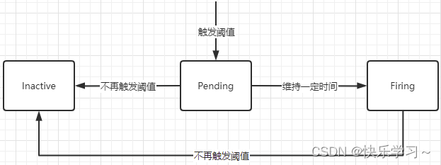
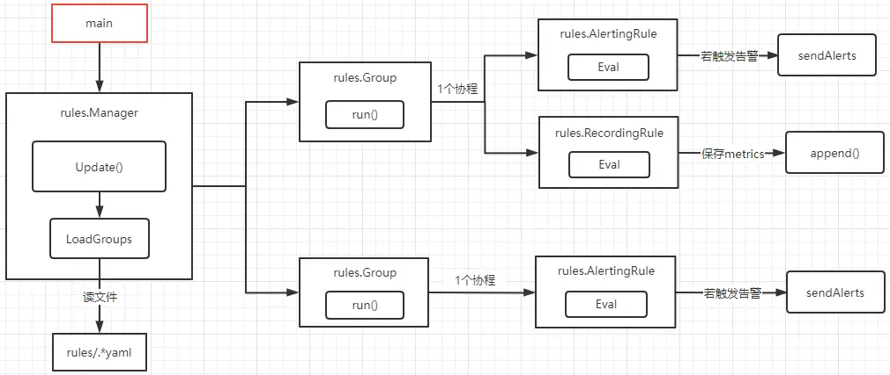

> Prometheus 알림 시스템의 내부 동작을 소스 코드 레벨에서 분석한 글이다. Rule Manager가 규칙 파일을 로드하고, 각 그룹을 주기적으로 평가하며, 최종적으로 Alertmanager에 알림을 전송하기까지의 전체 흐름을 다룬다.

---

## Alert의 3가지 상태

Prometheus 알림은 아래 3가지 상태를 전이하며 동작한다.


<small>출처: [CSDN - Prometheus 告警源码分析](https://blog.csdn.net/qq_43684922/article/details/126803304)</small>

| 상태 | 설명 |
|------|------|
| **Inactive** | 조건을 충족하지 않는 상태. 알림이 비활성. |
| **Pending** | 조건을 충족했지만 `for` 기간을 아직 채우지 못한 상태. |
| **Firing** | 조건을 충족한 상태가 `for` 기간 이상 지속되어 알림이 발송되는 상태. |

전체 흐름을 요약하면 다음과 같다:

- `rules.Manager`가 실행되면 `rules/*.yaml` 파일을 읽고 모든 `rules.Group`을 로드한다.
- 각 그룹에 1개의 고루틴을 할당하고, 그룹 내 모든 규칙을 주기적으로 실행한다.
- 각 규칙에 대해:
  - **AlertingRule**인 경우 `Eval`을 수행하고, 조건이 충족되면 `sendAlerts`로 알림을 전송한다.
  - **RecordingRule**인 경우 `Eval`을 수행하고 결과를 TSDB에 기록한다.


<small>출처: [CSDN - Prometheus 告警源码分析](https://blog.csdn.net/qq_43684922/article/details/126803304)</small>

---

## 1. Manager 구조체

`Manager`는 Recording Rule과 Alerting Rule을 총괄 관리하는 구조체다. 규칙 파일 검색, 규칙 로드, 실행, 알림 전송까지 모든 과정을 담당한다.

```go
// https://github.com/prometheus/prometheus/blob/main/rules/manager.go

type Manager struct {
    opts     *ManagerOptions
    groups   map[string]*Group  // 규칙 그룹
    mtx      sync.RWMutex
    block    chan struct{}       // 스토리지가 준비될 때까지 실행을 차단
    done     chan struct{}
    restored bool
    logger   log.Logger
}
```

### NewManager

Manager를 생성할 때 주요 구성 옵션은 다음과 같다:

- **Appendable**: 알림 규칙을 충족하는 데이터를 임시 저장하는 역할
- **Queryable**: Appendable에 저장된 데이터를 쿼리하는 역할
- **QueryFunc**: Prometheus 데이터를 쿼리하는 함수
- **NotifyFunc**: 알림 조건이 충족되면 Alertmanager로 알림을 전송하는 함수
- **ResendDelay**: 알림을 전송한 후, 이 시간이 지나야 재전송됨

```go
// https://github.com/prometheus/prometheus/blob/main/cmd/prometheus/main.go#L672

ruleManager = rules.NewManager(&rules.ManagerOptions{
    Appendable:      fanoutStorage,
    Queryable:       localStorage,
    QueryFunc:       rules.EngineQueryFunc(queryEngine, fanoutStorage),
    NotifyFunc:      rules.SendAlerts(notifierManager, cfg.web.ExternalURL.String()),
    Context:         ctxRule,
    ExternalURL:     cfg.web.ExternalURL,
    Registerer:      prometheus.DefaultRegisterer,
    Logger:          log.With(logger, "component", "rule manager"),
    OutageTolerance: time.Duration(cfg.outageTolerance),
    ForGracePeriod:  time.Duration(cfg.forGracePeriod),
    ResendDelay:     time.Duration(cfg.resendDelay),
})
```

---

## 2. 규칙 파일 로드

프로그램이 시작되면 일련의 reloader가 생성된다. 그 중 하나가 규칙 파일을 읽고 Manager를 업데이트하는 역할이다.

```go
// https://github.com/prometheus/prometheus/blob/main/cmd/prometheus/main.go#L814

reloaders := []reloader{
    {
        name: "rules",
        reloader: func(cfg *config.Config) error {
            if agentMode {
                return nil
            }

            var files []string
            for _, pat := range cfg.RuleFiles {
                fs, err := filepath.Glob(pat)
                if err != nil {
                    return fmt.Errorf("error retrieving rule files for %s: %w", pat, err)
                }
                files = append(files, fs...)
            }
            return ruleManager.Update(
                time.Duration(cfg.GlobalConfig.EvaluationInterval),
                files,
                cfg.GlobalConfig.ExternalLabels,
                externalURL,
                nil,
            )
        },
    },
}
```

설정 파일의 `rule_files` 항목에 지정된 패턴을 스캔하여, 매칭되는 모든 규칙 파일을 찾은 뒤 `Manager.Update()`를 호출한다.

---

## 3. Update: 규칙 그룹 갱신

`Update`는 규칙 파일을 파싱하고, 기존 그룹과 비교하여 변경된 그룹만 재시작하는 핵심 메서드다.

```go
// https://github.com/prometheus/prometheus/blob/main/rules/manager.go#L175

func (m *Manager) Update(interval time.Duration, files []string, externalLabels labels.Labels,
    externalURL string, groupEvalIterationFunc GroupEvalIterationFunc) error {
    m.mtx.Lock()
    defer m.mtx.Unlock()

    // 규칙 그룹 로드
    groups, errs := m.LoadGroups(interval, externalLabels, externalURL, groupEvalIterationFunc, files...)
    if errs != nil {
        for _, e := range errs {
            level.Error(m.logger).Log("msg", "loading groups failed", "err", e)
        }
        return errors.New("error loading rules, previous rule set restored")
    }
    m.restored = true

    var wg sync.WaitGroup
    for _, newg := range groups {
        // 이미 존재하는 동일한 그룹이 변경되지 않았으면 건너뜀
        gn := GroupKey(newg.file, newg.name)
        oldg, ok := m.groups[gn]
        delete(m.groups, gn)

        if ok && oldg.Equals(newg) {
            groups[gn] = oldg
            continue
        }

        // 변경된 그룹은 기존 것을 중지하고 새로 실행
        wg.Add(1)
        go func(newg *Group) {
            if ok {
                oldg.stop()
                newg.CopyState(oldg)
            }
            wg.Done()
            <-m.block  // 스토리지가 준비될 때까지 대기
            newg.run(m.opts.Context)  // 그룹 실행 시작
        }(newg)
    }

    // 더 이상 필요 없는 이전 그룹 정리
    wg.Add(len(m.groups))
    for n, oldg := range m.groups {
        go func(n string, g *Group) {
            g.markStale = true
            g.stop()
            // 관련 메트릭 정리 ...
            wg.Done()
        }(n, oldg)
    }

    wg.Wait()
    m.groups = groups
    return nil
}
```

핵심 포인트:

1. `LoadGroups`로 파일에서 규칙 그룹을 파싱한다.
2. 기존 그룹과 비교하여 **변경되지 않은 그룹은 그대로 유지**한다.
3. 변경된 그룹은 이전 것을 중지(`stop`)하고, 상태를 복사(`CopyState`)한 뒤 새로 실행한다.
4. `<-m.block` 채널을 통해 **스토리지가 초기화될 때까지 실행을 차단**한다. 규칙 평가 시 데이터를 쿼리해야 하는데, 데이터 소스가 아직 준비되지 않았을 수 있기 때문이다.

---

## 4. Group.run(): 주기적 규칙 실행

각 그룹은 독립적인 고루틴에서 `run()`을 실행한다. 알림은 기본적으로 **그룹 단위**로 동작한다.

```go
// https://github.com/prometheus/prometheus/blob/main/rules/group.go#L155

func (g *Group) run(ctx context.Context) {
    defer close(g.terminated)

    // 일관된 슬롯 간격을 위해 초기 대기
    evalTimestamp := g.EvalTimestamp(time.Now().UnixNano()).Add(g.interval)
    select {
    case <-time.After(time.Until(evalTimestamp)):
    case <-g.done:
        return
    }

    tick := time.NewTicker(g.interval)
    defer tick.Stop()

    // 첫 번째 평가 실행
    g.evalIterationFunc(ctx, g, evalTimestamp)

    // 복원이 필요한 경우 추가 평가 후 상태 복원
    if g.shouldRestore {
        select {
        case <-g.done:
            return
        case <-tick.C:
            missed := (time.Since(evalTimestamp) / g.interval) - 1
            evalTimestamp = evalTimestamp.Add((missed + 1) * g.interval)
            g.evalIterationFunc(ctx, g, evalTimestamp)
        }
        g.RestoreForState(time.Now())
        g.shouldRestore = false
    }

    // 타이머 루프: 주기적으로 규칙 평가 실행
    for {
        select {
        case <-g.done:
            return
        default:
            select {
            case <-g.done:
                return
            case <-tick.C:
                missed := (time.Since(evalTimestamp) / g.interval) - 1
                if missed > 0 {
                    g.metrics.IterationsMissed.WithLabelValues(GroupKey(g.file, g.name)).Add(float64(missed))
                    g.metrics.IterationsScheduled.WithLabelValues(GroupKey(g.file, g.name)).Add(float64(missed))
                }
                evalTimestamp = evalTimestamp.Add((missed + 1) * g.interval)
                g.evalIterationFunc(ctx, g, evalTimestamp)
            }
        }
    }
}
```

`evalIterationFunc`은 내부적으로 `g.Eval()`을 호출하고, 실행 시간과 메트릭을 기록한다:

```go
// https://github.com/prometheus/prometheus/blob/main/rules/manager.go#L76

func DefaultEvalIterationFunc(ctx context.Context, g *Group, evalTimestamp time.Time) {
    g.metrics.IterationsScheduled.WithLabelValues(GroupKey(g.file, g.name)).Inc()

    start := time.Now()
    g.Eval(ctx, evalTimestamp)
    timeSinceStart := time.Since(start)

    g.metrics.IterationDuration.Observe(timeSinceStart.Seconds())
    g.setEvaluationTime(timeSinceStart)
    g.setLastEvaluation(start)
    g.setLastEvalTimestamp(evalTimestamp)
}
```

---

## 5. Group.Eval(): 규칙 평가 실행

그룹 내 모든 규칙을 **순차적으로** 평가한다.

```go
func (g *Group) Eval(ctx context.Context, ts time.Time) {
    var samplesTotal float64

    for i, rule := range g.rules {
        select {
        case <-g.done:
            return
        default:
        }

        func(i int, rule Rule) {
            // 트레이싱 시작 ...

            g.metrics.EvalTotal.WithLabelValues(GroupKey(g.File(), g.Name())).Inc()

            // 규칙 평가 실행
            vector, err := rule.Eval(ctx, ts, g.opts.QueryFunc, g.opts.ExternalURL, g.Limit())
            if err != nil {
                rule.SetHealth(HealthBad)
                rule.SetLastError(err)
                g.metrics.EvalFailures.WithLabelValues(GroupKey(g.File(), g.Name())).Inc()
                return
            }
            rule.SetHealth(HealthGood)
            rule.SetLastError(nil)

            // AlertingRule이면 알림 전송
            if ar, ok := rule.(*AlertingRule); ok {
                ar.sendAlerts(ctx, ts, g.opts.ResendDelay, g.interval, g.opts.NotifyFunc)
            }

            // 결과를 TSDB에 기록
            app := g.opts.Appendable.Appender(ctx)
            for _, s := range vector {
                if s.H != nil {
                    _, err = app.AppendHistogram(0, s.Metric, s.T, nil, s.H)
                } else {
                    _, err = app.Append(0, s.Metric, s.T, s.F)
                }
                // 에러 처리 (OutOfOrder, TooOld, Duplicate 등) ...
            }
            app.Commit()
        }(i, rule)
    }
    g.cleanupStaleSeries(ctx, ts)
}
```

핵심 흐름:

1. 그룹 내 규칙을 하나씩 꺼내 `rule.Eval()`을 실행한다.
2. `AlertingRule`이면 `sendAlerts()`를 호출하여 알림 전송을 시도한다.
3. 평가 결과를 TSDB에 기록한다.

---

## 6. AlertingRule: 알림의 핵심

### AlertingRule 구조체

```go
type AlertingRule struct {
    name           string
    vector         parser.Expr          // 알림 조건 PromQL 표현식
    holdDuration   time.Duration        // for 기간
    keepFiringFor  time.Duration        // 해소 후에도 유지할 시간
    labels         labels.Labels
    annotations    labels.Labels
    active         map[uint64]*Alert    // 현재 활성 알림 (Pending 또는 Firing)
    // ...
}
```

`active` 맵이 핵심이다. 레이블셋의 fingerprint를 키로 사용하여 현재 활성화된 알림 목록을 관리한다.

### AlertingRule.Eval(): 상태 전이 로직

이 함수가 Prometheus Alert의 **상태 전이 로직의 핵심**이다.

```go
func (r *AlertingRule) Eval(ctx context.Context, ts time.Time, query QueryFunc,
    externalURL *url.URL, limit int) (promql.Vector, error) {

    // PromQL 쿼리 실행
    res, err := query(ctx, r.vector.String(), ts)
    if err != nil {
        return nil, err
    }

    resultFPs := map[uint64]struct{}{}
    alerts := make(map[uint64]*Alert, len(res))

    for _, smpl := range res {
        // 레이블 기반으로 해시값 생성
        lbs := lb.Labels()
        h := lbs.Hash()
        resultFPs[h] = struct{}{}

        alerts[h] = &Alert{
            Labels:   lbs,
            ActiveAt: ts,
            State:    StatePending,
            Value:    smpl.F,
        }
    }

    r.activeMtx.Lock()
    defer r.activeMtx.Unlock()

    // 이미 활성 상태인 알림은 값만 업데이트
    for h, a := range alerts {
        if alert, ok := r.active[h]; ok && alert.State != StateInactive {
            alert.Value = a.Value
            alert.Annotations = a.Annotations
            continue
        }
        r.active[h] = a
    }

    // 상태 전이 판단
    for fp, a := range r.active {
        if _, ok := resultFPs[fp]; !ok {
            // 이번 평가에서 조건을 충족하지 않는 경우
            if a.State == StatePending ||
               (!a.ResolvedAt.IsZero() && ts.Sub(a.ResolvedAt) > resolvedRetention) {
                delete(r.active, fp)  // 활성 목록에서 제거
            }
            if a.State != StateInactive {
                a.State = StateInactive
                a.ResolvedAt = ts
            }
            continue
        }

        // 이번 평가에서도 조건을 충족하는 경우
        if a.State == StatePending && ts.Sub(a.ActiveAt) >= r.holdDuration {
            a.State = StateFiring  // Pending → Firing 전이
            a.FiredAt = ts
        }
    }

    return vec, nil
}
```

여기서 `resolvedRetention`은 하드코딩된 상수로 **15분**이다:

```go
const resolvedRetention = 15 * time.Minute
```

### 상태 전이 규칙 정리

구체적인 상태 전이 규칙은 다음과 같다:

**1. 이전에 활성이었지만 이번 평가에서 조건을 충족하지 않는 경우**
  - `StatePending` 상태이거나, 해소된 지 15분이 지났다면 → **active 목록에서 삭제**
  - `StateInactive`가 아닌 상태라면 → **`StateInactive`로 변경**

**2. 이전에 활성이었고 이번 평가에서도 조건을 충족하는 경우**
  - `StatePending` 상태에서 `for` 기간을 초과했다면 → **`StateFiring`으로 변경**

**3. 새롭게 조건을 충족한 경우**
  - **`StatePending`으로 생성**하여 active 목록에 추가

---

## 7. sendAlerts(): 실제 알림 전송

`Eval()`에서는 상태만 변경하고, 실제 알림 전송은 `sendAlerts()`에서 수행한다.

```go
func (r *AlertingRule) sendAlerts(ctx context.Context, ts time.Time,
    resendDelay, interval time.Duration, notifyFunc NotifyFunc) {
    alerts := []*Alert{}
    r.ForEachActiveAlert(func(alert *Alert) {
        if alert.needsSending(ts, resendDelay) {
            alert.LastSentAt = ts
            // Eval 또는 Alertmanager 전송 실패 2회를 허용
            delta := resendDelay
            if interval > resendDelay {
                delta = interval
            }
            alert.ValidUntil = ts.Add(4 * delta)
            anew := *alert
            anew.Labels = alert.Labels.Copy()
            alerts = append(alerts, &anew)
        }
    })
    notifyFunc(ctx, r.vector.String(), alerts...)
}
```

### 알림 전송 조건

`needsSending`의 로직을 정리하면:

1. **`StatePending` 상태** → 알림을 전송하지 않는다.
2. **알림이 해소(Resolved)된 경우** → 해소 알림을 전송하여 문제가 해결되었음을 알린다.
3. **마지막 전송 이후 `ResendDelay` 이상 경과한 경우** → 알림을 재전송한다. 그렇지 않으면 전송하지 않는다.

`ValidUntil`은 `4 * delta`로 설정되는데, 이는 Eval 실패나 Alertmanager 전송 실패가 2회 연속 발생하더라도 알림이 유효하게 유지되도록 하기 위한 것이다.

---

## 전체 흐름 요약

```
main()
  └─ rules.NewManager()
       └─ reloader: Update()
            └─ LoadGroups()    ← 규칙 파일 파싱
            └─ Group.run()     ← 그룹별 고루틴 실행
                 └─ tick loop
                      └─ Group.Eval()
                           └─ for each rule:
                                ├─ AlertingRule.Eval()   ← 상태 전이
                                │    └─ query() → 결과 비교 → 상태 변경
                                ├─ sendAlerts()          ← 알림 전송
                                │    └─ needsSending() → notifyFunc()
                                └─ TSDB에 결과 기록
```

Prometheus의 알림 시스템은 **규칙 로드 → 주기적 평가 → 상태 전이 → 알림 전송**이라는 명확한 파이프라인으로 구성되어 있다. 특히 `StatePending` 상태를 두어 일시적인 조건 충족에 대한 불필요한 알림을 방지하고, `resolvedRetention`(15분)을 통해 해소된 알림의 상태를 일정 기간 유지하는 설계가 인상적이다.

---

## Reference

- [Prometheus Source Code - rules/manager.go](https://github.com/prometheus/prometheus/blob/main/rules/manager.go)
- [Prometheus Source Code - rules/group.go](https://github.com/prometheus/prometheus/blob/main/rules/group.go)
- [Prometheus Source Code - rules/alerting.go](https://github.com/prometheus/prometheus/blob/main/rules/alerting.go)
